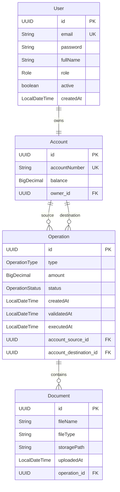
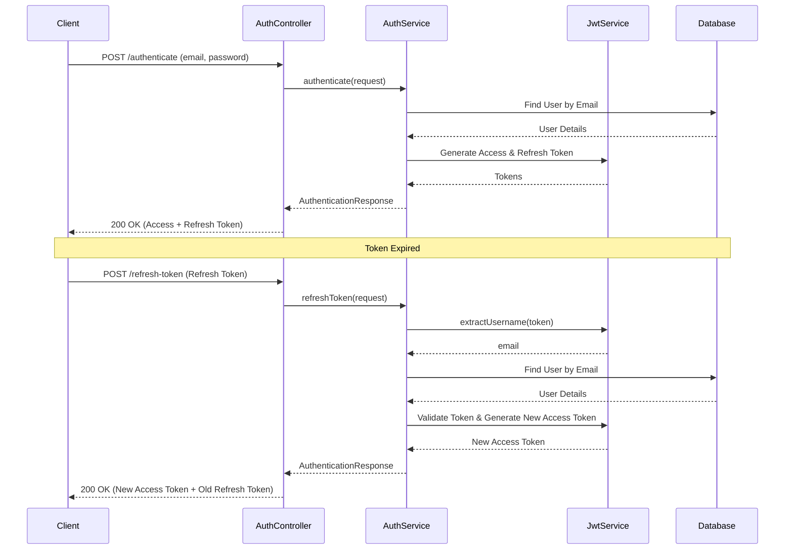
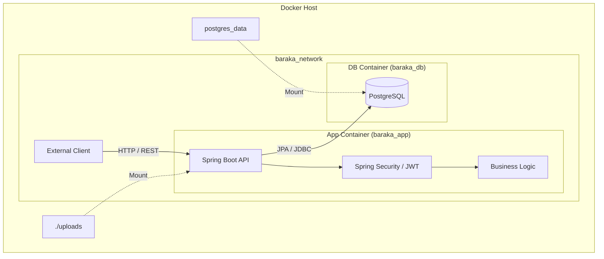

# Al Baraka Digital Banking API

Al Baraka Digital is a backend service designed to digitize banking operations for clients and internal agents. It provides a secure and robust REST API for managing users, bank accounts, operations, and documents.

## 🚀 Key Features

- **User Management**: Registration and authentication with Role-Based Access Control (RBAC).
- **Roles**: `CLIENT`, `AGENT`, `ADMIN`.
- **Secure Authentication**: Stateless authentication using JWT (Access Token + Refresh Token).
- **Account Management**: Create and manage bank accounts.
- **Operations**: Perform banking transactions.
- **Document Management**: Upload and manage user documents.
- **Database Migrations**: Managed via Liquibase.
- **Containerization**: Fully Dockerized environment for easy deployment.

## 🛠️ Technology Stack

- **Language**: Java 17
- **Framework**: Spring Boot 3.5.8
- **Database**: PostgreSQL 17
- **ORM**: Hibernate / Spring Data JPA
- **Migrations**: Liquibase
- **Security**: Spring Security, JWT (JJWT)
- **Mapper**: MapStruct
- **Utilities**: Lombok, Dotenv
- **Build Tool**: Maven

## 📂 Project Structure

```
├── src
│   ├── main
│   │   ├── java/com/al_baraka_digital/Baraka
│   │   │   ├── config        # Security & App Config
│   │   │   ├── controller    # REST Controllers
│   │   │   ├── dto           # Data Transfer Objects
│   │   │   ├── model         # JPA Entities
│   │   │   ├── repository    # Data Access Layer
│   │   │   ├── security      # JWT Filters & Utils
│   │   │   └── service       # Business Logic
│   │   └── resources
│   │       ├── db/changelog  # Liquibase Scripts
│   │       └── application.properties
├── docker-compose.yml        # Docker orchestration
└── README.md
```

## 📊 Architecture & Design

### 1. Database Schema (ERD)



### 2. Authentication Flow



### 3. System Architecture



## ⚙️ Prerequisites

- **Java 17+**
- **Maven 3.8+**
- **Docker & Docker Compose**

## ⚡ Getting Started

### 1. Clone the Repository

```bash
git clone https://github.com/achraf99sik/al_baraka_digital.git
cd al_baraka_digital
```

### 2. Environment Configuration

The project uses `dotenv-java`. You can configure your environment variables in a `.env` file (or use default values).
Copy the example file:

```bash
cp .env.example .env
```

**Key Variables:**

- `PG_HOST`, `PG_PORT`, `PG_DB`, `PG_USERNAME`, `PG_PASSWORD`
- `JWT_SECRET`, `JWT_ACCESS_EXPIRATION`, `JWT_REFRESH_EXPIRATION`

### 3. Run with Docker (Recommended)

Build and start the services (App + Database) with a single command:

```bash
docker-compose up -d --build
```

- **API URL**: `http://localhost:3000`
- **Database Port**: `5435`

### 4. Run Manually

If you prefer running locally without Docker for the app (but using Docker for DB):

start the database:

```bash
docker-compose up db -d
```

Run the application:

```bash
./mvnw spring-boot:run
```

- **API URL**: `http://localhost:8080` (Note: Port is 8080 when running locally, 3000 via Docker Compose)

## 🔌 API Documentation

A Postman collection is included in the root directory: `AlBaraka_Digital.postman_collection.json`.

### Main Endpoints

#### Authentication

- `POST /api/v1/auth/register` - Register a new user
- `POST /api/v1/auth/authenticate` - Login (Returns Access + Refresh Token)
- `POST /api/v1/auth/refresh-token` - Refresh Access Token

#### Users (Admin/Agent)

- `GET /api/v1/users` - List users
- `PUT /api/v1/users/{id}` - Update user

#### Accounts

- `POST /api/v1/accounts` - Create account
- `GET /api/v1/accounts/{id}` - Get account details

#### Operations

- `POST /api/v1/operations` - Perform transfer/deposit/withdrawal

## 🧪 Testing

Run unit and integration tests:

```bash
./mvnw test
```

## 🤝 Contributing

1.  Fork the repository
2.  Create your feature branch (`git checkout -b feature/AmazingFeature`)
3.  Commit your changes (`git commit -m 'Add some AmazingFeature'`)
4.  Push to the branch (`git push origin feature/AmazingFeature`)
5.  Open a Pull Request
